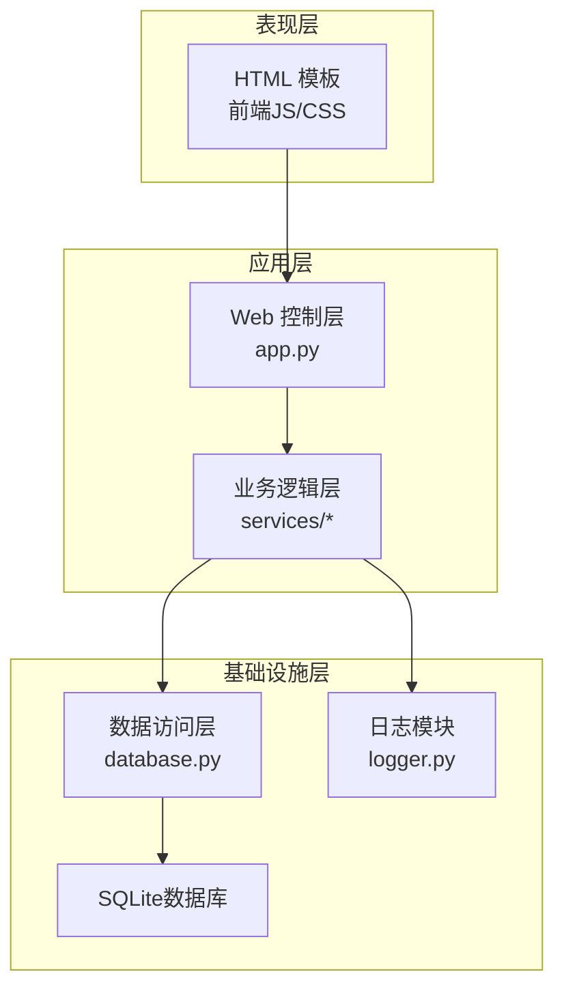
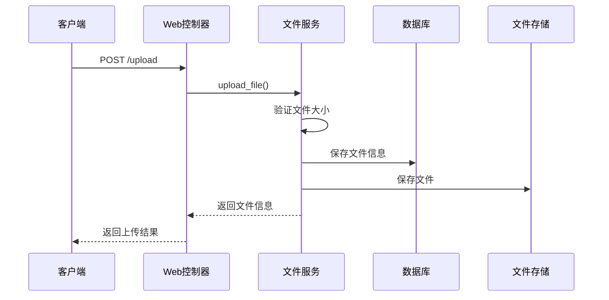
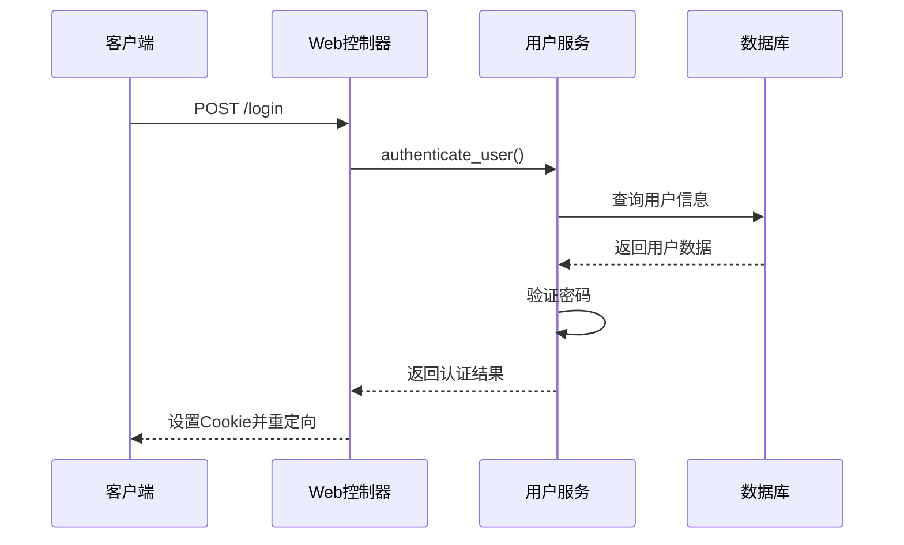

# anyShare 项目模块化重构与日志增强设计文档

## 1. 概述

### 1.1 项目背景
anyShare 是一个简洁高效的临时文件分享系统，旨在提供安全、便捷的文件分享方式。项目当前采用单文件架构，所有业务逻辑集中在 `app.py` 文件中，随着功能增加，维护和扩展变得困难。

### 1.2 重构目标
1. 对项目进行模块化重构，将业务逻辑分离到独立模块中
2. 使用 loguru 库替换现有 logging 实现，提升日志功能和可读性
3. 保持现有业务逻辑和页面 UI 不变
4. 保持项目使用 uv 实现 Python 环境管理

### 1.3 预期收益
- 提高代码可维护性和可读性
- 增强日志功能，便于问题排查和系统监控
- 降低模块间耦合度，提高代码复用性
- 保持现有功能完整性

## 2. 架构设计

### 2.1 当前架构分析
当前项目采用典型的三层架构：
- 表现层：HTML 模板和前端 JavaScript
- 应用层：app.py 中的路由和控制器函数
- 数据层：database.py 模块和 SQLite 数据库

### 2.2 重构后架构
重构后将采用更清晰的模块化架构：



### 2.3 模块划分

#### 2.3.1 Web 控制层 (app.py)
- 职责：处理 HTTP 请求和响应，路由分发
- 保持现有 Bottle 框架路由机制
- 不包含业务逻辑，仅负责调用业务逻辑层

#### 2.3.2 业务逻辑层 (services/*)
- 文件服务模块 (services/file_service.py)
- 用户服务模块 (services/user_service.py)
- 系统服务模块 (services/system_service.py)

#### 2.3.3 数据访问层 (database.py)
- 保持现有数据库操作逻辑
- 仅负责数据的增删改查操作

#### 2.3.4 日志模块 (logger.py)
- 使用 loguru 实现日志功能
- 提供统一的日志配置和输出接口

## 3. 模块详细设计

### 3.1 日志模块 (logger.py)

#### 3.1.1 模块职责
- 提供统一的日志记录接口
- 配置日志输出格式和级别
- 实现日志文件轮转功能
- 支持控制台和文件双输出

#### 3.1.2 接口设计
```python
# logger.py
from loguru import logger

def setup_logger(log_folder: str, log_level: str = "INFO"):
    """
    配置日志器
    
    Args:
        log_folder: 日志文件存储目录
        log_level: 日志级别
    """
    pass

def get_logger():
    """
    获取日志器实例
    
    Returns:
        logger: loguru logger 实例
    """
    pass
```

### 3.2 文件服务模块 (services/file_service.py)

#### 3.2.1 模块职责
- 处理文件上传、下载、删除等业务逻辑
- 文件信息管理
- 过期文件清理逻辑

#### 3.2.2 接口设计
```python
# services/file_service.py
def upload_file(file_data, user_info, client_ip):
    """
    处理文件上传业务逻辑
    """
    pass

def download_file(file_hash, password, client_ip):
    """
    处理文件下载业务逻辑
    """
    pass

def delete_file(file_hash, user_info, client_ip):
    """
    处理文件删除业务逻辑
    """
    pass

def cleanup_expired_files():
    """
    清理过期文件
    """
    pass
```

### 3.3 用户服务模块 (services/user_service.py)

#### 3.3.1 模块职责
- 处理用户认证和授权逻辑
- 用户管理功能
- 密码管理逻辑

#### 3.3.2 接口设计
```python
# services/user_service.py
def authenticate_user(username, password):
    """
    用户认证
    """
    pass

def get_user_files(username):
    """
    获取用户文件列表
    """
    pass

def add_user(admin_user, new_username, password, is_admin):
    """
    添加用户
    """
    pass

def delete_user(admin_user, username_to_delete):
    """
    删除用户
    """
    pass

def change_password(current_user, target_username, new_password):
    """
    修改密码
    """
    pass
```

### 3.4 系统服务模块 (services/system_service.py)

#### 3.4.1 模块职责
- 系统配置管理
- 健康检查
- 统计信息计算

#### 3.4.2 接口设计
```python
# services/system_service.py
def get_system_config():
    """
    获取系统配置
    """
    pass

def health_check():
    """
    系统健康检查
    """
    pass

def calculate_statistics(files):
    """
    计算文件统计信息
    """
    pass
```

## 4. 数据模型与 ORM 映射

### 4.1 当前数据模型保持不变
- 用户表 (users)
- 文件表 (files)

### 4.2 数据访问接口保持不变
- add_file()
- get_user()
- get_user_files()
- delete_expired_files()
- 等现有 database.py 中的接口

## 5. API 端点参考

### 5.1 路由保持不变
所有现有 API 端点保持不变，仅调整实现方式：

| 方法 | 路径 | 描述 |
|------|------|------|
| GET | / | 主页 |
| GET/POST | /login | 用户登录 |
| POST | /upload | 文件上传 |
| GET | /upload | 上传成功页面 |
| GET | /file | 文件访问页面 |
| POST | /verify | 密码验证 |
| GET | /admin | 管理员页面 |
| GET | /myfiles | 用户文件页面 |
| POST | /delete/<file_hash> | 删除文件 |
| POST | /users/add | 添加用户 |
| POST | /users/delete | 删除用户 |
| POST | /password | 修改密码 |
| GET | /logout | 用户登出 |
| GET | /api/config | 获取配置 |
| GET | /api/healthz | 健康检查 |

### 5.2 请求/响应模式保持不变
- 请求参数格式保持不变
- 响应数据格式保持不变
- 错误处理机制保持不变

## 6. 业务逻辑层架构

### 6.1 文件处理流程


### 6.2 用户认证流程


## 7. 中间件与拦截器

### 7.1 认证中间件
保持现有的 Cookie 认证机制，仅调整实现位置。

### 7.2 日志中间件
使用 loguru 的中间件功能记录请求日志。

## 8. 测试策略

### 8.1 单元测试
- 为每个服务模块编写单元测试
- 保持现有测试用例的兼容性
- 使用 mock 技术隔离外部依赖

### 8.2 集成测试
- 验证模块间接口调用正确性
- 确保重构后功能与之前一致

### 8.3 现有测试兼容性
- 确保 tests/ 目录下的测试用例仍能通过
- 必要时调整测试用例以适应新架构