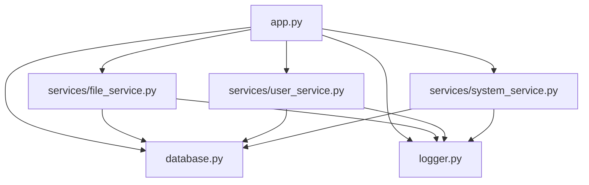
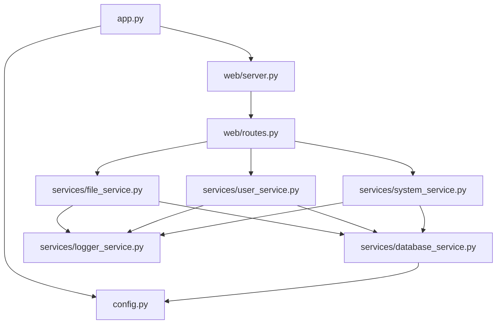

# anyShare 服务模块化重构设计文档

## 1. 概述

### 1.1 项目背景
anyShare 是一个简洁高效的临时文件分享系统，旨在提供安全、便捷的文件分享方式。当前系统已经实现了基本的模块化结构，但仍有进一步优化的空间。

### 1.2 重构目标
本次重构的主要目标是：
1. 将 [logger.py](file:///Users/nice/Jinlin/PythonCase/anyShare/logger.py) 和 [database.py](file:///Users/nice/Jinlin/PythonCase/anyShare/database.py) 迁移到 `services` 目录中
2. 将 web 服务从 [app.py](file:///Users/nice/Jinlin/PythonCase/anyShare/app.py) 中拆分出来
3. 实现更完整的模块化结构，提高代码的可维护性和可扩展性

### 1.3 预期收益
- 提高代码组织性，使项目结构更加清晰
- 增强模块间的独立性，降低耦合度
- 提升代码的可测试性和可维护性
- 为未来功能扩展提供更好的架构基础

## 2. 当前架构分析

### 2.1 现有目录结构
```
.
├── services/
│   ├── file_service.py
│   ├── system_service.py
│   └── user_service.py
├── static/
├── views/
├── app.py
├── database.py
├── logger.py
└── ...
```

### 2.2 现有模块依赖关系


### 2.3 现有问题
1. [database.py](file:///Users/nice/Jinlin/PythonCase/anyShare/database.py) 和 [logger.py](file:///Users/nice/Jinlin/PythonCase/anyShare/logger.py) 位于项目根目录，不符合模块化设计理念
2. [app.py](file:///Users/nice/Jinlin/PythonCase/anyShare/app.py) 承担了过多职责，既是应用入口也是 Web 服务实现
3. 模块间依赖关系不够清晰，部分功能可以进一步解耦

## 3. 重构设计方案

### 3.1 目标架构
```
.
├── services/
│   ├── database_service.py  (原 database.py)
│   ├── logger_service.py    (原 logger.py)
│   ├── file_service.py
│   ├── system_service.py
│   └── user_service.py
├── web/
│   ├── routes.py            (从 app.py 拆分的路由定义)
│   └── server.py            (Web 服务启动相关)
├── static/
├── views/
├── app.py                   (应用入口)
├── config.py                (配置管理)
└── ...
```

### 3.2 模块重构计划

#### 3.2.1 迁移 database.py 到 services 目录
- 将 [database.py](file:///Users/nice/Jinlin/PythonCase/anyShare/database.py) 重命名为 `database_service.py` 并移动到 `services/` 目录
- 更新所有引用 [database.py](file:///Users/nice/Jinlin/PythonCase/anyShare/database.py) 的模块，使其引用 `services.database_service`

#### 3.2.2 迁移 logger.py 到 services 目录
- 将 [logger.py](file:///Users/nice/Jinlin/PythonCase/anyShare/logger.py) 重命名为 `logger_service.py` 并移动到 `services/` 目录
- 更新所有引用 [logger.py](file:///Users/nice/Jinlin/PythonCase/anyShare/logger.py) 的模块，使其引用 `services.logger_service`

#### 3.2.3 拆分 app.py 中的 Web 服务
- 将路由定义从 [app.py](file:///Users/nice/Jinlin/PythonCase/anyShare/app.py) 拆分到 `web/routes.py`
- 将 Web 服务器启动逻辑拆分到 `web/server.py`
- [app.py](file:///Users/nice/Jinlin/PythonCase/anyShare/app.py) 仅保留应用入口功能

### 3.3 新模块依赖关系


## 4. 详细实现方案

### 4.1 数据库服务模块 (database_service.py)
将 [database.py](file:///Users/nice/Jinlin/PythonCase/anyShare/database.py) 移动到 `services/database_service.py`，保持原有功能不变。

### 4.2 日志服务模块 (logger_service.py)
将 [logger.py](file:///Users/nice/Jinlin/PythonCase/anyShare/logger.py) 移动到 `services/logger_service.py`，保持原有功能不变。

### 4.3 Web 路由模块 (web/routes.py)
从 [app.py](file:///Users/nice/Jinlin/PythonCase/anyShare/app.py) 中提取所有路由定义，创建 `web/routes.py` 文件：

```python
from bottle import Bottle, redirect, request, response, static_file, template

from services.file_service import upload_file, download_file, delete_file, update_file_expiry
from services.user_service import authenticate_user, add_user as service_add_user, delete_user as service_delete_user, change_password, get_all_users as service_get_all_users
from services.system_service import get_system_config, update_system_config, health_check, calculate_statistics, format_size, get_relative_time

# 创建Bottle应用
app = Bottle()

# 路由定义
@app.route("/static/<filepath:path>")
def server_static(filepath):
    # ... 静态文件服务逻辑 ...

@app.route("/")
def index():
    # ... 主页处理逻辑 ...

# ... 其他路由定义 ...
```

### 4.4 Web 服务器模块 (web/server.py)
创建 `web/server.py` 文件，负责 Web 服务器的启动和配置：

```python
import os
import threading
import time
from datetime import UTC, datetime, timedelta, timezone

from waitress import serve

from services.database_service import init_db, delete_expired_files
from services.logger_service import setup_logger, get_logger
from web.routes import app

def setup_app(config):
    """配置应用"""
    # 创建上传文件夹
    if not os.path.exists(config.UPLOAD_FOLDER):
        os.makedirs(config.UPLOAD_FOLDER)

    # 初始化数据库
    init_db()

    # 初始化日志器
    setup_logger(config.LOG_FOLDER)
    app_logger = get_logger()
    
    return app_logger

def start_cleanup_task():
    """启动定时清理任务"""
    def run_cleanup_task():
        while True:
            delete_expired_files()
            time.sleep(24 * 60 * 60)  # 每天执行一次
    
    cleanup_thread = threading.Thread(target=run_cleanup_task, daemon=True)
    cleanup_thread.start()

def start_server(config, app_logger):
    """启动Web服务器"""
    app_logger.info("Starting server...")
    serve(app, host=config.HOST, port=config.PORT, threads=config.THREADS)
```

### 4.5 配置管理模块 (config.py)
创建 `config.py` 文件，集中管理应用配置：

```python
import os

class Config:
    # 应用配置
    HOST = os.getenv("HOST", "0.0.0.0")
    PORT = int(os.getenv("PORT", 8080))
    THREADS = int(os.getenv("THREADS", 64))
    
    # 路径配置
    UPLOAD_FOLDER = os.getenv("UPLOAD_FOLDER", "./upload")
    LOG_FOLDER = os.getenv("LOG_FOLDER", "./log")
    
    # 功能配置
    ANONYMOUS = os.getenv("ANONYMOUS", "true")
    FILE_LIMIT_SIZE = os.getenv("FILE_LIMIT_SIZE", "10.00")
    USER_LIMIT_SIZE = os.getenv("USER_LIMIT_SIZE", "2.00")
    
    # 数据库配置
    DB_NAME = os.getenv("DB_NAME", "anyshare.db")
    
    # 管理员配置
    ADMIN_USERNAME = os.getenv("ADMIN_USERNAME", "admin")
    ADMIN_PASSWORD = os.getenv("ADMIN_PASSWORD", "admin")
```

### 4.6 应用入口 (app.py)
重构 [app.py](file:///Users/nice/Jinlin/PythonCase/anyShare/app.py) 为纯粹的应用入口：

```python
from config import Config
from web.server import setup_app, start_cleanup_task, start_server

def main():
    # 加载配置
    config = Config()
    
    # 配置应用
    app_logger = setup_app(config)
    
    # 启动定时任务
    start_cleanup_task()
    
    # 启动服务器
    start_server(config, app_logger)

if __name__ == "__main__":
    main()
```

## 5. 迁移步骤

### 5.1 准备阶段
1. 创建 `web/` 目录
2. 备份现有文件

### 5.2 文件迁移
1. 将 [database.py](file:///Users/nice/Jinlin/PythonCase/anyShare/database.py) 移动到 `services/database_service.py`
2. 将 [logger.py](file:///Users/nice/Jinlin/PythonCase/anyShare/logger.py) 移动到 `services/logger_service.py`
3. 创建 `config.py` 配置文件
4. 创建 `web/routes.py` 路由文件
5. 创建 `web/server.py` 服务器文件

### 5.3 代码重构
1. 更新所有模块中的导入语句
2. 将路由定义从 [app.py](file:///Users/nice/Jinlin/PythonCase/anyShare/app.py) 移动到 `web/routes.py`
3. 将服务器启动逻辑从 [app.py](file:///Users/nice/Jinlin/PythonCase/anyShare/app.py) 移动到 `web/server.py`
4. 将配置相关代码提取到 `config.py`

### 5.4 测试验证
1. 运行单元测试确保功能正常
2. 手动测试核心功能
3. 验证所有 API 接口正常工作

## 6. 风险评估与应对措施

### 6.1 主要风险
1. 导入路径错误导致应用无法启动
2. 功能模块间依赖关系处理不当
3. 配置管理不当导致功能异常

### 6.2 应对措施
1. 重构过程中逐步验证，确保每一步修改后应用仍能正常运行
2. 使用版本控制工具管理代码变更，便于回滚
3. 编写详细的测试用例，确保重构后功能正常

## 7. 测试计划

### 7.1 单元测试
- 验证各服务模块功能正常
- 验证数据库操作正确性
- 验证日志功能正常

### 7.2 集成测试
- 验证 Web 路由正常工作
- 验证文件上传下载功能
- 验证用户认证和权限控制

### 7.3 系统测试
- 验证应用整体功能正常
- 验证配置管理功能
- 验证定时任务正常执行

## 8. 部署说明

### 8.1 环境要求
- Python 3.13+
- 依赖包通过 `uv sync` 安装

### 8.2 部署步骤
1. 更新代码库
2. 安装依赖：`uv sync`
3. 启动应用：`python app.py`

### 8.3 配置变更
- 环境变量配置保持兼容
- 无需修改现有部署脚本