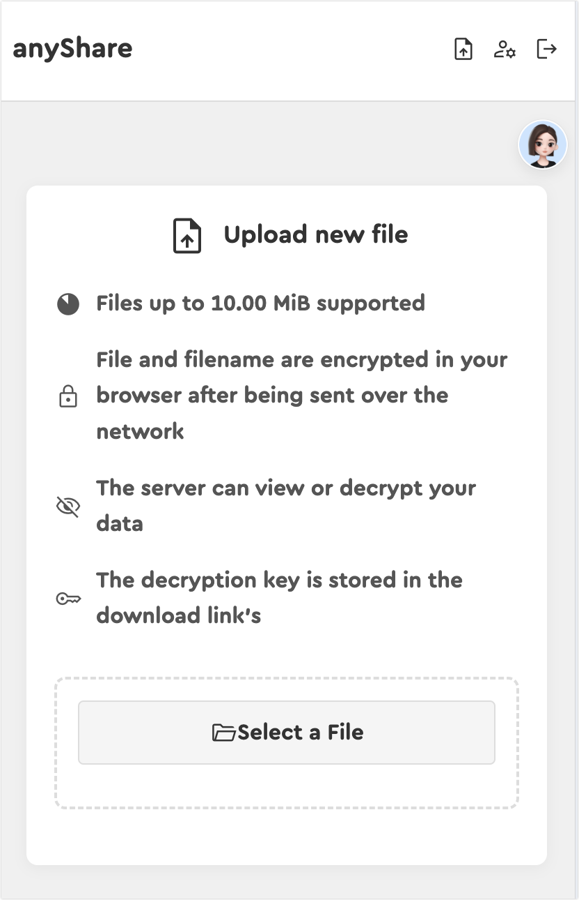

# anyShare - 简洁高效的临时文件分享平台

anyShare 是一个用 Python 和 Bottle 构建的轻量级文件分享解决方案。它允许用户快速上传文件，生成安全的、受密码保护的分享链接，并可以为文件设置自动过期时间。项目内置了管理员后台，方便对文件和用户进行管理。

  <!-- 请替换为您的项目截图链接 -->

## ✨ 功能特性

- **多用户支持**: 支持管理员和普通用户角色，保障文件隔离与安全。
- **文件上传**: 提供直观的拖拽或点击选择方式上传文件。
- **大文件支持**: 实现分片上传与断点续传，轻松应对大文件传输场景。
- **高效下载**: 支持范围请求（Range requests），实现分片下载与下载任务恢复。
- **安全分享**: 自动为每个文件生成唯一的分享链接和6位随机访问密码。
- **自动过期**: 可为文件设置过期时间（1小时、1天、1周、1个月或永久），过期文件将自动清理。
- **管理员后台**:
    - 查看系统统计信息（活跃文件数、已用空间等）。
    - 集中管理所有用户上传的文件。
    - 管理用户账户（添加、删除）。
- **匿名访问控制**: 可通过环境变量轻松开启或关闭匿名上传功能。
- **容器化部署**: 提供 `Dockerfile` 和 `compose.yaml`，支持一键启动服务。
- **健康检查**: 内置 `/api/healthz` 端点，便于监控服务状态。

## 🛠️ 技术栈

- **后端**: Python 3.13+, Bottle
- **WSGI 服务器**: Waitress
- **前端**: HTML5, CSS3, JavaScript (原生)
- **数据库**: SQLite
- **依赖管理**: uv
- **容器化**: Docker, Docker Compose

## 🚀 快速开始

### 先决条件

- Docker
- Docker Compose (或支持 `compose` 命令的 Docker CLI)

### 使用 Docker 部署 (推荐)

1.  **克隆项目仓库**:
    ```bash
    git clone https://github.com/GmoneyLtd/anyshare.git
    cd anyShare
    ```

2.  **创建数据目录**:
    为了持久化存储上传的文件和日志，请先创建本地目录。
    ```bash
    mkdir -p ./log ./upload
    ```

3.  **启动服务**:
    使用 Docker Compose 启动服务。项目将会在后台运行。
    ```bash
    docker compose up -d
    ```
    服务启动后，默认可以通过 `http://localhost:8000` 访问。

4.  **访问应用**:
    - **首页**: `http://localhost:8000`
    - **管理员后台**: `http://localhost:8000/admin`

### 本地开发环境

1.  **克隆项目仓库**。

2.  **安装 Python 依赖**:
    推荐使用 `uv` 进行依赖管理。
    ```bash
    uv sync
    ```

3.  **配置环境变量**:
    根据需要，在启动应用前设置环境变量 (参见下一节 "配置")。

4.  **启动应用**:
    ```bash
    python app.py
    ```
    应用默认将在 `http://localhost:8000` 启动。

## ⚙️ 配置

anyShare 通过环境变量进行配置。以下是所有可用的配置项：

| 环境变量          | 描述                                     | 默认值 (app.py) | `compose.yaml` 示例 |
| ----------------- | ---------------------------------------- | ----------------- | --------------------- |
| `HOST`            | 服务器监听的主机地址                     | `0.0.0.0`         | -                     |
| `PORT`            | 服务器监听的端口                         | `8000`            | -                     |
| `THREADS`         | Waitress 服务器的工作线程数              | `4`               | -                     |
| `LOG_LEVEL`       | 日志级别 (e.g., `DEBUG`, `INFO`)         | `DEBUG`           | `DEBUG`               |
| `UPLOAD_FOLDER`   | 上传文件存储目录                         | `./upload`        | - (通过卷映射)      |
| `LOG_FOLDER`      | 日志文件存储目录                         | `./log`           | - (通过卷映射)      |
| `ANONYMOUS`       | 是否允许匿名上传 (`true` 或 `false`)     | `true`            | `false`               |
| `FILE_LIMIT_SIZE` | 最大文件上传大小 (单位 MiB)              | `10.00`           | -                     |
| `USER_LIMIT_SIZE` | (暂未实现) 用户总空间限制 (单位 GiB)     | `2.00`            | -                     |
| `DB_NAME`         | SQLite 数据库文件名                      | `anyshare.db`     | -                     |
| `ADMIN_USERNAME`  | 默认管理员用户名                         | `admin`           | `admin`               |
| `ADMIN_PASSWORD`  | 默认管理员密码                           | `admin`           | `admin`               |
| `COOKIE_SECRET`   | 用于签名会话 Cookie 的密钥。为了安全，建议设置为一个长的随机字符串。 | (自动生成)        | `your-super-secret-key` |

**注意**: 在使用 Docker Compose 部署时，`compose.yaml` 文件中定义的环境变量会覆盖代码中的默认值。

## 🔒 安全增强

- **Cookie 安全**: 为了防止会话劫持，应用的会话 Cookie 使用一个安全的、随机生成的密钥进行签名。您可以通过设置 `COOKIE_SECRET` 环境变量来提供自己的密钥。

## 📂 项目结构

```
anyShare/
├── .dockerignore         # Docker 忽略文件
├── .gitignore            # Git 忽略文件
├── Dockerfile            # Docker 配置文件
├── README.md             # 项目说明文件
├── app.py                # 应用主入口
├── compose.yaml          # Docker Compose 配置文件
├── config.py             # 配置加载模块
├── pyproject.toml        # Python 项目依赖定义
├── uv.lock               # 依赖版本锁定文件
├── services/             # 业务逻辑层
│   ├── chunk_upload_service.py
│   ├── database_service.py
│   ├── file_service.py
│   ├── logger_service.py
│   ├── range_download_service.py
│   ├── system_service.py
│   └── user_service.py
├── static/               # 静态资源 (CSS, JS, etc.)
│   ├── css/
│   ├── font/
│   ├── image/
│   └── js/
├── upload/               # (运行时生成) 上传文件存储目录
├── log/                  # (运行时生成) 日志文件目录
└── views/                # Bottle HTML 模板
    ├── admin.html
    ├── error.html
    ├── index.html
    ├── login.html
    ├── myfiles.html
    ├── password.html
    └── upload.html
```

## 🤝 贡献

欢迎通过提交 Pull Request 或 Issue 的方式为本项目做出贡献。

## 📄 许可证

本项目当前未指定开源许可证。
